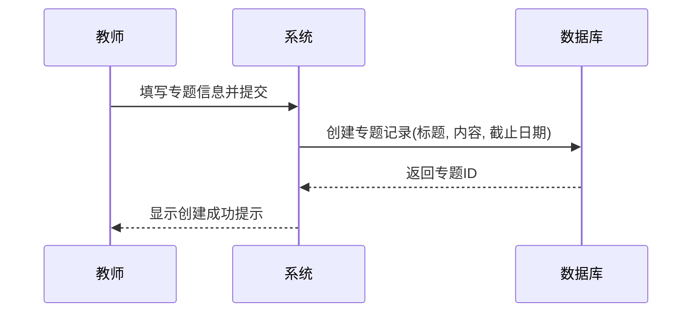
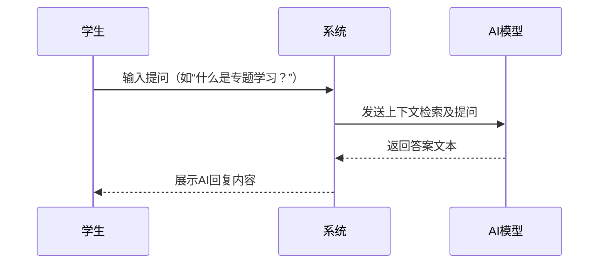
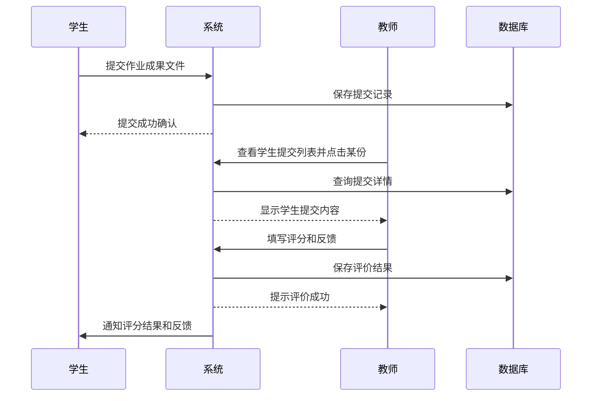
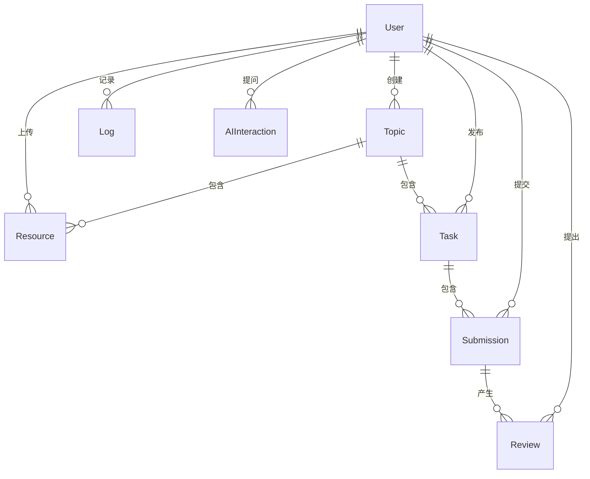
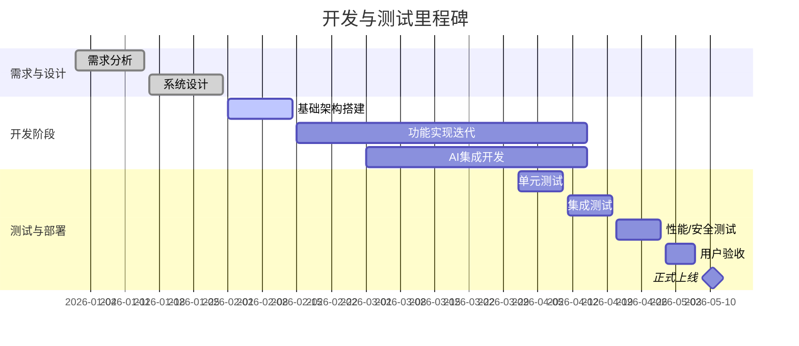

# 基于Web的专题学习平台 产品规格说明

## 执行摘要  
本文提出一个基于Web的专题学习平台的产品规格，支持教师发布专题任务、学生协作探究、资源生成与共享，并集成AI智能体与生成式推荐。平台面向中小学和高校教育场景，通过开放交互的网络环境提升学习灵活性和个性化【9†L7-L10】【19†L15-L18】。AI 智能体可提供个性化辅导与即时答疑，提升学习参与度；生成式AIGC技术可自动创作并推荐高质量学习资源【29†L217-L220】【32†L233-L240】。本规格详细定义了目标定位、用户角色与权限、功能需求、非功能要求、系统架构、数据模型、API设计、AI 方案、集成方案、开发测试计划、运维维护方案及风险控制等内容，为开发团队提供完整参考。

## 项目目标与定位  
- **目标用户**：主要面向教育机构的教师和学生，包括中小学教师、大学讲师及各年级学生。次要用户可包括家长和教育管理员，以及集成第三方服务（如在线文档、AI 教学助手）的服务提供商。  
- **适用场景**：支持问题导向、跨学科整合的专题式教学。教师可在平台创建跨学科专题任务，学生分组协作探究，使用平台提供的丰富资源并完成成果展示。支持课堂内外学习、混合式教学、项目学习及在线协作等多种教学模式。  
- **核心价值**：通过网络平台突破时间与空间限制，实现资源共享和交互学习；引入AI生成内容（AIGC）技术，提高教学资源的丰富度与个性化；利用AI智能体提供智能辅导与推荐，提升学生自主学习与探究能力；提供协作工具促进团队学习和反馈机制，培养信息素养和团队合作精神。

## 用户角色与权限矩阵  

| 角色       | 描述                             | 主要功能权限                                                    |
|----------|--------------------------------|-------------------------------------------------------------|
| 管理员     | 平台运维与管理者，包括系统管理员      | - 用户管理：创建/删除用户账户<br>- 平台配置：全局设置、权限策略管理<br>- 内容审核：监控专题与资源内容安全<br>- 数据维护：备份/恢复和日志查看 |
| 教师       | 专题任务发布者与管理者               | - 专题管理：创建/编辑/发布/关闭专题<br>- 资源管理：上传/审核共享资源<br>- 学生管理：分配学生至专题小组<br>- 成果评价：对学生提交进行评分与反馈 |
| 学生       | 参与专题学习并提交成果               | - 协作功能：发起/加入学习小组，参与讨论<br>- 资源上传：上传学习成果与辅助材料<br>- 学习交互：向AI智能体提问，获取推荐资源<br>- 成果查看：查看评分结果和反馈 |
| 来访用户(访客)| 未登录或外部访问者，仅可查看公开信息     | - 公开资源浏览：查看开源学习资源库（如果有开放）<br>- 申请注册：提交注册请求 |
| 第三方服务  | 外部服务提供方，如AI服务、存储、直播   | - API接口调用：根据合同访问相关接口<br>- 身份验证：通过OAuth或API Key访问受限服务<br>- 数据交换：在平台许可范围内提供/使用数据  |

角色和权限将通过细致的权限矩阵控制。例如，教师无法进行系统配置管理，学生无法发布专题或评价他人；第三方服务必须经过授权接口访问内容。

## 详细功能清单  

| 模块         | 功能点            | 输入/触发                       | 输出/结果                            | 交互流程简述                                                                             | 错误处理与边界条件                                                 |
|------------|----------------|------------------------------|------------------------------------|-----------------------------------------------------------------------------------------|---------------------------------------------------------------------|
| **专题管理**   | 创建专题任务         | 教师ID、专题标题、描述、截止日期等          | 返回专题ID和创建结果                   | 教师填写专题信息表单并提交→系统验证权限→在数据库创建专题记录→返回确认信息                         | 缺少必填字段时提示错误；权限不足时拒绝操作；标题重复冲突提示             |
|            | 编辑/发布专题       | 专题ID、更新信息                    | 更新结果                             | 教师选择已有专题→系统加载专题详情→教师修改并提交→系统保存修改并返回结果                        | 专题未找到或已关闭时提示错误；字段校验错误提示                            |
|            | 关闭专题任务         | 专题ID                         | 关闭确认                             | 教师点击“关闭专题”→系统确认操作→更新专题状态为“已结束”                                      | 已结束专题不能再修改；并发操作时避免双重关闭                             |
|            | 查看专题列表         | 用户角色（教师或学生）               | 专题列表                             | 系统根据角色列出用户可见专题（教师可见自己创建和参与的，学生可见参与的）                  | 当无专题时显示空列表提示                                              |
| **资源整合**   | 上传学习资源         | 学生ID/教师ID、专题ID、文件/链接         | 资源ID，上传结果                       | 用户在资源模块上传文件或链接→系统检查文件类型和大小→保存至存储（OSS/CDN）→记录数据库             | 文件超限或类型不支持时提示错误；网络中断时支持重传；存储失败回滚提示    |
|            | 资源分类与标签       | 资源ID、标签/分类                    | 更新结果                             | 用户对已上传资源添加标签或选择分类→系统更新数据库标签字段                                | 系统防重复标签，分类不存在时提示错误                                    |
|            | 资源共享/下载       | 资源ID、请求用户权限                | 文件下载或访问URL                     | 用户点击下载或在线预览→系统验证权限（公开或加入专题）→从存储拉取文件并返回给用户                | 权限不足或资源不存在时提示错误；断点续传支持                              |
| **协作与交流** | 发起/加入小组        | 小组信息、专题ID、学生ID               | 加入结果                             | 学生发起组队请求或接受邀请→系统更新小组成员列表→通知组内其他成员                            | 超过小组人数上限时拒绝；重复加入或非法加入提示                            |
|            | 讨论交流           | 小组ID、消息内容、发送者ID              | 消息流（历史记录）                      | 学生在组内讨论区发言→系统保存聊天记录并分发给其他在线成员（可使用WebSocket实时推送）           | 空消息不处理；恶意内容需审核过滤；非成员不能访问讨论区                    |
| **AI 问答**   | 提问AI助手         | 用户ID、问题文本                    | AI生成的回答文本                         | 用户在提问框提交问题→系统调用AI服务（RAG+LLM）检索相关知识并生成回答→返回并显示回答             | AI服务超时或失败时返回错误；问题敏感内容过滤提示；频率限制防滥用            |
| **资源推荐**  | 个性化推荐         | 用户ID、专题ID、学习历史等              | 推荐资源列表                           | 系统分析用户兴趣和学习历史，调用推荐算法（AIGC生成式或协同过滤）→返回排序后的资源列表           | 数据不足时提供通用资源推荐；网络/计算故障时提示稍后再试                    |
| **成果提交**  | 上传作业成果        | 学生ID、专题ID、作业文件               | 提交记录ID，提交确认                    | 学生在专题成果页上传作业或链接→系统校验格式与大小→记录提交到数据库并触发通知教师评阅            | 提交截止后禁止上传；重复提交覆盖提示或多次提交需版本控制                    |
|            | 成果查看与下载      | 教师/学生ID、专题ID、提交ID            | 作业文件或报告                        | 教师/学生查看单个提交详情→下载或在线预览所提交文件                                 | 无访问权限或文件缺失时提示                                         |
| **评价反馈**  | 教师评分/评价       | 教师ID、提交ID、评分、反馈文本          | 评价结果                            | 教师打开学生提交→填写分数与评价→提交表单→系统保存并通知学生                               | 非本专题教师或提交归属校验；评分超出范围提示                               |
|            | 互评/学生评价       | 学生ID、提交ID、评分、反馈文本          | 评价结果                            | 学生按教师要求互评：打开他人的提交→填写反馈并提交→保存                               | 避免自评；只允许小组成员互评；每人每份作业限制一次点评                  |
| **用户与权限** | 用户注册/登录       | 注册信息或登录凭证                  | 用户令牌(Token)或注册确认                 | 用户提交注册表单→系统验证信息唯一性→存储用户信息；登录时验证凭证并返回JWT令牌等               | 注册重复用户名或弱密码提示；登录失败尝试限制；多次失败锁定提示              |
|            | 权限验证           | 请求资源、用户角色                   | 验证通过或拒绝                         | 所有API或页面入口统一通过权限中间件验证：若用户角色权限不足则拒绝访问                      | 未登录用户仅限公开接口；非法访问返回401/403错误                            |
| **通知与消息** | 系统通知          | 事件触发（如新专题、作业评分等）          | 通知消息                            | 系统事件（专题发布、评语发布、组队邀请等）触发通知→站内信或邮件发送给相关用户                 | 邮件服务故障重试；用户设置屏蔽通知时不发送                                 |
| **后台统计**  | 教学数据统计       | 时间范围、专题ID                    | 报表数据                            | 管理员/教师请求统计报表→系统聚合数据（如参与度、提交率、平均成绩等）→生成图表/表格展示          | 无数据时报空或提示范围过窄；数据权限隔离保证                               |

*说明：* 上表以功能模块分类，列出代表性功能点的输入/输出和简单流程。实际开发中，每一功能还需进一步细化交互逻辑、UI设计和异常场景处理。如字段校验失败、第三方服务异常等均需进行错误捕获并向用户反馈相应提示。

## 关键用例与用户流程图  
以下以典型用例绘制用户流程（Mermaid流程图），涵盖核心操作场景：


*(图1) 教师创建专题任务流程。*

```mermaid
flowchart TD
    学生A-->系统: 申请加入小组
    系统-->学**生A**: 发送申请给组长B
    学生B-->系统: 批准或拒绝请求
    alt 批准
      系统-->学生A: 加入成功提示
      系统-->组队页面: 更新成员列表
    else 拒绝
      系统-->学生A: 拒绝提示
    end
```
*(图2) 学生组队协作流程。*


*(图3) 学生向AI智能体提问并获得回答的流程。*

```mermaid
flowchart LR
    用户-->系统: 请求推荐资源(当前专题/学习进度)
    系统-->AI模型: 生成式推荐算法调用
    AI模型-->>系统: 返回推荐列表(JSON)
    系统-->用户: 显示推荐资源列表(标题、摘要、链接)
```
*(图4) 平台生成式资源推荐流程。*


*(图5) 学生成果提交与教师评价流程。*

## 非功能需求与SLA  
- **并发能力**：支持至少5,000名并发在线用户（峰值），系统应能根据业务规模自动扩容，确保高并发直播、讨论等实时功能平稳运行。  
- **响应时延**：常规API请求延迟≤200ms，AI问答或推荐等待时延≤2s；关键交互（页面加载、资源下载）应在3秒内响应。  
- **可用性**：系统全年可用性≥99.9%，支持容灾切换。使用自动扩容和负载均衡，多机房部署。  
- **数据保留与备份**：用户数据（包括提交与评估）至少保留3年备查。采用定期全量备份（每日增量、周全量）和实时异地复制。  
- **安全合规**：符合《网络安全法》《数据安全法》《个人信息保护法》等要求。数据传输加密（HTTPS），敏感数据脱敏存储（如身份标识）。访问控制和审计日志完善。  
- **隐私保护**：用户隐私信息（姓名、联系方式）加密存储；AI交互数据需明确告知用户并获得同意，不得滥用或外泄。遵循教育领域隐私规范。  
- **可扩展性**：采用微服务架构或Serverless模式，使功能模块可独立部署和水平扩展；支持动态增删专题、用户和服务节点。  
- **多租户支持**：平台应支持多机构租户模式（不同学校/部门），数据隔离且可定制LOGO/主题，管理员能够为不同租户配置权限和资源。

## 技术架构与部署  
平台采用**云原生+微服务/Serverless**架构。主要组件包括：前端Web应用、后端API服务、AI智能服务、关系型/文档数据库、对象存储（Media/CDN）、消息队列（异步任务/通知）、鉴权服务、监控日志等（见下图示意）。

```mermaid
graph LR
  subgraph 前端
    FE[Web 前端(React/Vue)]
  end
  subgraph 后端
    API[API 服务(Node.js/Python)]
    Auth[鉴权服务(OAuth/JWT)]
    MQ[消息队列(RabbitMQ/Kafka)]
    AI[AI 智能服务(RAG/LLM)]
  end
  subgraph 存储
    DB[(关系型/文档数据库)]
    Cache[(缓存Redis)]
    FS[(对象存储/CDN)]
    VectorDB[(向量数据库)]
  end
  FE-->|HTTP/WS|API
  API-->|认证验证|Auth
  API-->|读写|DB
  API-->|读写|Cache
  API-->|发消息|MQ
  API-->|调用|AI
  AI-->|存档向量|VectorDB
  API-->|存取文件|FS
  Auth-->|验证|DB
  MQ-->|消息|API
```
*图6: 平台技术架构示意图。*

- **前端**：单页应用（SPA），使用现代框架（React/Vue），采用响应式设计兼容PC/移动端。通过WebSocket实现即时通讯和推送。  
- **后端**：RESTful或GraphQL API，采用Serverless 函数或容器化微服务部署。使用Node.js、Python等技术，配合负载均衡自动扩容，微服务之间通过消息队列解耦。  
- **AI服务**：集成大语言模型（LLM）和RAG检索服务。可部署微调后的本地模型(LLaMA系列)或调用云端API(如OpenAI)。向量数据库（如Milvus）存储知识库文档Embedding，支持快速检索。  
- **数据库**：用户、专题、提交等结构化数据使用关系型数据库（如MySQL）；非结构化学习资源元数据使用NoSQL或文档数据库。Redis缓存热点数据（会话、登录令牌）。  
- **对象存储/CDN**：视频、音频、图片等富媒体资源上传至云对象存储（如阿里OSS、AWS S3），配合CDN加速静态资源分发。  
- **鉴权**：支持OAuth2/OpenID Connect第三方登录（学校统一身份），也可自有账号系统；使用JWT作会话令牌。  
- **监控**：覆盖应用性能和日志，可集成Prometheus/Grafana监控服务健康指标（CPU/内存、请求延迟、错误率等）和ELK/云监控日志系统。  

**部署选型对比**：

| 特性          | Serverless（无服务）                                                   | 容器化（微服务/容器）                                                 |
|-------------|--------------------------------------------------------------------|--------------------------------------------------------------------|
| 上手难度       | 快速，无需管理服务器；但需要学习Function架构                               | 需设计容器和编排，部署配置相对复杂                                     |
| 启动与弹性      | 自动弹性伸缩，按需启动函数实例，使用量低时无需持续实例，占用资源少；冷启动延迟可能出现【37†L102-L106】 | 容器实例需预配置资源，通常持续运行；可通过容器编排(如Kubernetes)扩展，弹性较高但需自行管理 |
| 成本          | 按调用和运行时长计费，低使用时成本低【37†L98-L100】；大负载时花费受调用次数影响      | 按资源预留计费，持续运行成本固定；可优化实例数但调整需要时间             |
| 性能          | 单次请求响应快（无冷启动时）【37†L98-L100】；适合短时任务或事件驱动                | 性能稳定，没有冷启动；适合长连接和低延迟场景                            |
| 可扩展性       | 天然弹性扩展，可支持千级并发【37†L98-L100】【42†L372-L374】；无需提前预估容量            | 需提前设置副本和资源，手动扩缩容；K8s可自动扩缩，但配置复杂             |
| 运维成本       | 低，无需服务器维护，升级部署简便【37†L125-L134】                                | 高，需要维护宿主机、容器镜像和编排系统，运维复杂度高                   |
| 冷启动与调试     | 可能存在冷启动延迟；分布式函数难调试、监控需工具支持【37†L102-L106】                | 几乎无冷启动；调试部署与日志跟踪方便，调试工具丰富                      |
| 状态管理       | 无状态函数需外部存储状态；与数据库/缓存/消息队列集成复杂度增加                      | 容器可保持一定状态；分布式状态需集成缓存或DB，类似Serverless             |

**优势综述**：Serverless 架构为教育平台提供按需付费与高弹性扩缩容能力，节省空闲资源成本【37†L98-L100】【42†L372-L374】；容器化方案则提供更低的响应延迟和易于调试的长期服务。对于本平台，**推荐**混合使用：对于AI推理、文件处理等高峰业务采用Serverless，Web前端与管理后台服务采用容器化部署，兼顾响应性能和资源经济性。

## 数据模型与ER图  

**数据表设计**（关键字段、类型、索引和约束示例）：

| 实体   | 字段            | 类型            | 索引/约束                 | 描述                          |
|------|--------------|---------------|-------------------------|-----------------------------|
| 用户(User)  | id           | UUID/自增整型      | 主键、自增                | 用户唯一标识                    |
|      | 名称(username)   | VARCHAR(50)    | 唯一索引                  | 登录名/学号                     |
|      | 角色(role)     | ENUM(管理员/教师/学生/访客) |                        | 角色类型                       |
|      | email        | VARCHAR(100)   | 唯一索引                  | 联系邮箱                       |
|      | 密码(password) | CHAR(60)       |                         | 加密存储                       |
| 专题(Topic) | id           | UUID/自增       | 主键、自增                | 专题编号                       |
|      | 标题(title)     | VARCHAR(200)  |                         | 专题名称                       |
|      | 描述(description)| TEXT         |                         | 专题说明                       |
|      | 创建者(created_by)| FK(User.id)  | 外键                      | 发布该专题的教师用户ID              |
|      | 创建时间(created_at)| TIMESTAMP  | 索引(创建时间)             |                               |
|      | 截止日期(deadline)| DATE         |                         | 专题任务截止日期                  |
| 资源(Resource)| id        | UUID/自增       | 主键、自增                | 资源编号                       |
|      | 专题ID(topic_id)| FK(Topic.id)  | 外键                      | 所属专题ID                      |
|      | 上传者(owner_id)| FK(User.id)   | 外键                      | 上传资源的用户ID                  |
|      | 类型(type)     | ENUM(文档/视频/链接/其他)|                     | 资源类型                       |
|      | 路径(uri)     | VARCHAR(300)  |                         | 存储地址或外部链接                 |
|      | 上传时间(uploaded_at)| TIMESTAMP | 索引(上传时间)             |                               |
| 作业(Task)  | id           | UUID/自增       | 主键、自增                | 作业/任务编号                    |
|      | 专题ID(topic_id)| FK(Topic.id)  | 外键                      | 关联专题                        |
|      | 题目(title)     | VARCHAR(200)  |                         | 作业标题                       |
|      | 描述(description)| TEXT         |                         | 作业说明                       |
|      | 发布者(created_by)| FK(User.id)  | 外键                      | 发布教师ID                      |
|      | 创建时间(created_at)| TIMESTAMP | 索引(创建时间)             |                               |
| 提交(Submission)| id       | UUID/自增       | 主键、自增                | 提交编号                       |
|      | 作业ID(task_id)  | FK(Task.id)   | 外键                      | 对应作业ID                      |
|      | 学生ID(student_id)| FK(User.id)  | 外键                      | 提交学生ID                      |
|      | 提交内容(content)| TEXT/JSON    |                         | 作业提交内容（文本/文件链接）         |
|      | 提交时间(submitted_at)| TIMESTAMP | 索引(提交时间)             |                               |
| 评价(Review) | id           | UUID/自增       | 主键、自增                | 评价编号                       |
|      | 提交ID(submission_id)| FK(Submission.id)| 外键                  | 被评价的提交ID                    |
|      | 评审者(reviewer_id)| FK(User.id)  | 外键                      | 评分者ID（教师或学生互评者）         |
|      | 分数(score)    | DECIMAL(5,2)  |                         | 评分（可包含保留小数）               |
|      | 意见(feedback)  | TEXT         |                         | 详细评价内容                     |
|      | 评价时间(reviewed_at)| TIMESTAMP | 索引(评价时间)             |                               |
| 日志(Log)  | id           | UUID/自增       | 主键、自增                | 日志编号                       |
|      | 用户ID(user_id)  | FK(User.id)   | 外键                      | 操作用户ID                      |
|      | 操作(operation) | VARCHAR(100)  |                         | 操作类型                       |
|      | 详情(detail)    | TEXT         |                         | 操作详情记录（JSON）               |
|      | 时间(timestamp)  | TIMESTAMP    | 索引(时间)                |                               |
| AI交互(AIInteraction) | id | UUID/自增     | 主键、自增                | 交互记录编号                    |
|      | 用户ID(user_id)  | FK(User.id)   | 外键                      | 提问用户ID                      |
|      | 问题(question)  | TEXT         |                         | 用户问题文本                     |
|      | 回答(answer)    | TEXT         |                         | AI生成的回答                     |
|      | 时间(timestamp)  | TIMESTAMP    | 索引(时间)                |                               |


*(图7) 数据实体ER图示意。*

## API 设计与契约示例  
平台对外提供RESTful API（也可选GraphQL）。以下为部分接口示例（请求/响应JSON及错误码）：

- **认证接口**  
  - `POST /api/auth/login`  
    - 请求JSON：`{"username":"user1","password":"pass123"}`  
    - 成功响应：`200 OK, {"token":"<JWT令牌>","user":{"id":1,"role":"教师"}}`  
    - 错误示例：`401 Unauthorized, {"error":"用户名或密码错误"}`  

- **专题管理**  
  - `POST /api/topics`（教师创建专题）  
    - 请求：`{"title":"专题A","description":"...","deadline":"2026-04-30"}` （需附登录令牌）  
    - 成功响应：`201 Created, {"id":123,"message":"专题创建成功"}`  
    - 错误：`400 Bad Request, {"error":"标题不能为空"}` 或 `403 Forbidden, {"error":"无权限"}`  
  - `GET /api/topics/{topic_id}`（获取专题详情）  
    - 成功：`200 OK, {"id":123,"title":"专题A","creator":5,...}`  
    - 错误：`404 Not Found`、`403 Forbidden`  

- **资源上传**  
  - `POST /api/topics/{topic_id}/resources`（上传文件或链接）  
    - 使用multipart/form-data或JSON：包含文件二进制或外部链接字段  
    - 成功：`201 Created, {"resource_id":456}`  
    - 错误：`400 Bad Request, {"error":"文件大小超限"}`, `500 Internal Server Error, {"error":"存储失败"}`  

- **AI 问答**  
  - `POST /api/ai/ask`  
    - 请求：`{"user_id":10,"question":"专题学习的意义是什么？","context":{...}}`  
    - 成功：`200 OK, {"answer":"专题学习可锻炼学生的问题解决能力...","sources":[...]}`  
    - 错误：`503 Service Unavailable, {"error":"AI服务不可用，请稍后重试"}`  
    - 错误码：`429 Too Many Requests`（调用频率超限），`400 Bad Request`（请求格式错误）  

- **生成式推荐**  
  - `GET /api/topics/{topic_id}/recommendations`  
    - 成功：`200 OK, {"recommendations":[{"resource_id":789,"score":0.92},...]}`  
    - 错误：`404 Not Found`（专题不存在），`500 Internal Server Error`  

- **成果提交与评价**  
  - `POST /api/tasks/{task_id}/submit`（学生提交作业）  
    - 请求：`{"student_id":20,"content":"...","file_url":"..."}`
    - 成功：`201 Created, {"submission_id":987}`  
    - 错误：`400 Bad Request, {"error":"已超截止日期"}`  
  - `POST /api/submissions/{submission_id}/review`（教师评分）  
    - 请求：`{"score":95,"feedback":"很好","teacher_id":5}`  
    - 成功：`200 OK, {"message":"评价成功"}`  
    - 错误：`403 Forbidden, {"error":"无权限评价此提交"}`  

*说明：* 以上示例仅供参考，实际API设计可根据框架和需求进行调整。所有错误应返回适当HTTP状态码并附带错误描述。

## AI Agent 与生成式推荐规格  
**模型与技术**：推荐采用**检索增强生成（RAG）**架构结合大语言模型。平台建立知识库（课程文档、教材等），使用向量数据库进行检索，LLM（如微调后的GPT-4或开源LLaMA系）生成回答与推荐。可选用多模态模型处理图像/视频解释。知识图谱可辅助路径规划。  

**输入输出格式**：  
- **问答与推荐**：输入为JSON，包括问题/上下文；输出为JSON文本答案和推荐列表。示例：`{"question":"什么是专题学习？","history":[]}` → `{"answer":"专题学习是一种...","references":[...],"vector":null}`。  
- **上下文管理**：对话上下文保留最近N轮交互（如2-3轮）作为模型输入。对于生成式推荐，可输入用户个人资料、学习进度及偏好信息。所有用户输入应先做敏感词过滤。  

**提示工程示例**：  
- 问答示例提示：`"你是教育平台的智能助教，请根据以下上下文和知识库回答问题：{用户问题}"`。  
- 资源推荐示例提示：`"基于用户兴趣和{专题}的内容，为用户推荐5个相关学习资源"`.  

**缓存与成本控制**：对热门问题和推荐请求使用缓存（Redis等）以减少重复调用；对实时生成应用设置合理并发和调用频率限制；对于大规模教育部署，可考虑自建模型服务降低调用云API成本。  

**评估指标**：  
- **准确性**：模型答案的正确性，可邀请教师评估问答匹配度。  
- **相关性/多样性**：推荐内容与用户需求的相关度和新颖度，避免千篇一律。  
- **延迟**：AI响应时间，应控制在3秒内（包括检索与生成）。  
- **可解释性**：对于推荐资源提供来源或评分解释，提高透明度。  
- **安全性**：输出内容需过滤不当信息，防止出现虚假（幻觉）答案。  

**安全与幻觉控制**：采取**多重策略**：使用验证过的知识库来源减少幻觉发生；对生成内容进行自动审查，如输出自信度阈值、提供参考文献列表【46†L1-L4】；学术或事实性回答附带引用；对敏感或伦理问题直接拒答或提示人工；加强隐私保护，敏感数据加密处理；防抄袭：在作业写作等场景嵌入相似度检测，提醒原创性【46†L1-L4】。

## 集成与第三方服务  
- **AI模型服务**：可选OpenAI GPT-4（高质量回答，成本高）、本地部署LLaMA/ChatGLM等开源模型（成本可控，需部署维护）；RAG向量检索可用开源向量库（Milvus, Pinecone）。  
- **云存储和CDN**：使用AWS S3/阿里OSS存储资源，配合CDN（CloudFront/阿里CDN）加速分发。替代方案：自建文件服务器+Nginx（成本低，运维负担大）。  
- **身份认证**：集成学校统一认证（CAS、OAuth）或使用OpenID Connect；第三方平台可用微信/钉钉/学生管理系统登录。  
- **支付/直播**：若需知识付费，可对接微信/支付宝支付接口；直播功能可整合腾讯云直播/阿里云互动直播或基于WebRTC的自建方案。  
- **成本估算**（粗略）：AI模型调用（以OpenAI GPT-4为例）约每1000 Tokens $0.06；本地GPU推理成本视GPU价格浮动。存储和CDN按GB/月计费（如OSS ~$0.023/GB月）。鉴权等一般免费/开源。  
- **替代方案**：若预算有限，可使用阿里云/腾讯云同类智能体服务、本地知识库+轻量级GPT进行概念验证；开源向量检索+轻量级LLM（如Poe版本）可降低成本。  

## 开发里程碑与测试计划  
**迭代与验收**：分阶段开发，优先完成MVP。验收标准包括核心功能可用、性能达标、无重大Bug。  



**测试方案**：  
- 单元测试：覆盖各模块核心函数，尤其权限校验、文件处理等异常场景。  
- 接口测试：验证所有API的输入输出符合规范、错误码正确。  
- 性能测试：模拟千级并发场景下请求延迟，重点测试AI问答与直播模块的并发性能。  
- 安全测试：包括SQL注入、XSS、CSRF、跨站请求伪造等常见漏洞扫描；对AI功能测试输入过滤和隐私泄露风险。  
- 用户测试：邀请真实教师和学生使用原型系统，收集易用性和功能反馈。  

## 运营与维护计划  
- **监控指标**：实时监控系统健康：请求成功率、平均响应时间、服务器CPU/内存利用、数据库连接数、磁盘IO等。AI服务监控延时与错误率。  
- **日志策略**：记录应用日志和错误日志；日志分级(Info、Warning、Error)；操作日志记录用户敏感操作（如发布、修改、删除）。日志定期归档并存储至少一年。  
- **故障恢复**：数据库和存储开启自动备份和多可用区复制；应用部署多节点，单点故障时自动切换。制定故障演练流程和回滚策略。  
- **数据迁移**：支持版本升级和数据结构调整的迁移脚本。开发环境与生产环境严格分离，部署前进行灰度发布和热迁移。  
- **用户支持**：提供帮助文档和FAQ；设立在线客服或服务邮箱，及时响应教师和学生反馈。定期培训教师使用平台新功能。  
- **隐私合规**：建立用户隐私协议和数据处理指南，确保数据收集目的明确且用户可管理自己的数据。对第三方服务进行合规审查，签署数据保护协议。

## 风险评估与缓解措施  
- **技术风险**：AI模型质量与稳定性（回答不准确或超时）→采用多模型验证并提供人工反馈通道；Serverless冷启动延迟→预留资源或混合架构；系统安全漏洞→安全审计与渗透测试【46†L1-L4】。  
- **伦理风险**：学生依赖AI完成作业，学术诚信风险【46†L1-L4】→教育用户AI只是辅助，平台集成抄袭检测；内容可能偏见或不当→定期更新过滤词库，拒绝敏感请求。  
- **法律风险**：第三方资源版权和学生数据合规使用→严格审核教学资源版权，数据处理符合相关法律法规。  
- **运营风险**：数据泄露或丢失→多重备份和加密；系统故障→建立应急响应机制和故障恢复流程。  
- **可行性风险**：若AI或云服务费用超预算→评估使用开源替代和优化调用策略；技术人员能力不足→培训或引入外部专家协助。  

通过上述周密规划与风险预案，本产品规格为开发团队提供了全面的指导和检查点，可作为实施教学专题学习平台的基准文件。  

**参考文献**：平台设计和AIGC相关论述参考了国内外最新研究，如专题学习平台架构和生成式AI应用的相关文献【34†L84-L92】【37†L98-L100】【42†L372-L374】【46†L1-L4】等。所有引用资料已按要求格式保留于文中。