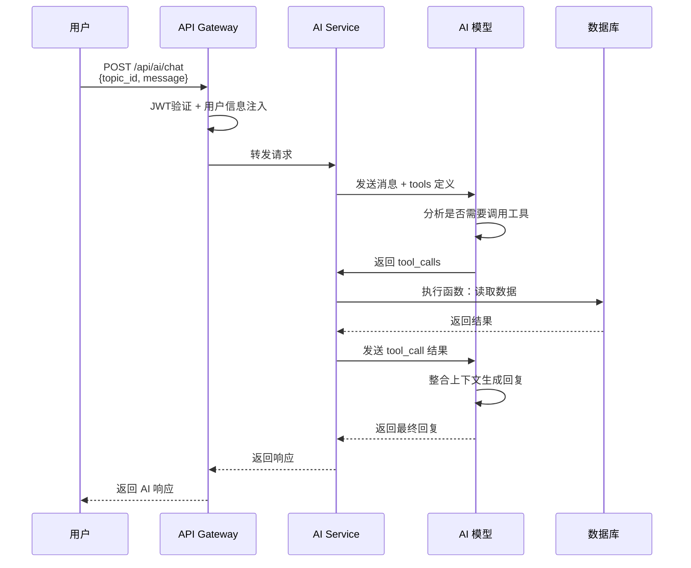
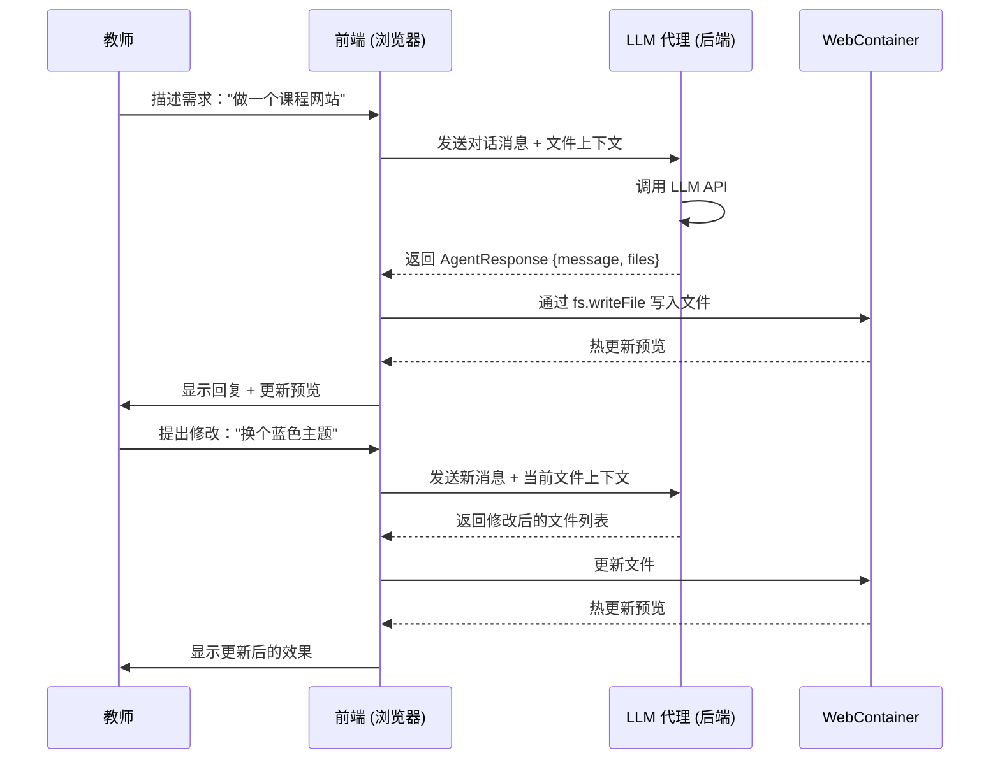

# AI Agent 系统

> 最后更新：2026-04-08

## 概述

- **学习助手 Agent**：服务学生与教师，聚焦学习问答与专题内容解释
- **专题搭建 Agent**：服务教师，在网站编辑器中通过对话主动协作生成网站

**实现方式：** 采用 OpenAI API 兼容的 function calling 格式，不自定义格式。

**微服务架构：**
- AI Service（端口 3003）独立运行 Agent 服务
- 通过 Gateway（端口 3000）统一入口：`POST /api/ai/chat`
- AI Service 可访问 `auth_users`、`topic_topics` 表（只读）

**专题搭建 Agent 新架构：**
- 前端通过 WebContainer 运行网站代码
- 后端 LLM 代理（Topic Space Service）遵循 OpenAI SDK 标准格式
- Agent 返回 JSON 格式的文件操作指令（create/update/delete），前端执行文件写入

---

## 1. 学习助手 Agent

### 定位与目标

目标用户：学生、教师（需登录）

核心功能：围绕当前专题回答问题，解释专题内容，辅助学习理解。

设计原则：

- 上下文感知：问题必须绑定 `topic_id`，回答带专题上下文。
- 有据可查：回答引用网站页面内容来源，避免"无依据建议"。
- 只读优先：学习助手不修改业务数据。

### Agent 工具定义（OpenAI Function Calling 格式）

```json
{
  "tools": [
    {
      "type": "function",
      "function": {
        "name": "get_topic_info",
        "description": "获取专题基础信息与状态",
        "parameters": {
          "type": "object",
          "properties": {
            "topic_id": {
              "type": "integer",
              "description": "专题ID"
            }
          },
          "required": ["topic_id"]
        }
      }
    },
    {
      "type": "function",
      "function": {
        "name": "get_topic_files",
        "description": "获取专题的网站文件列表",
        "parameters": {
          "type": "object",
          "properties": {
            "topic_id": {
              "type": "integer",
              "description": "专题ID"
            }
          },
          "required": ["topic_id"]
        }
      }
    },
    {
      "type": "function",
      "function": {
        "name": "read_file",
        "description": "读取指定文件的内容",
        "parameters": {
          "type": "object",
          "properties": {
            "topic_id": {
              "type": "integer",
              "description": "专题ID"
            },
            "file_path": {
              "type": "string",
              "description": "文件路径"
            }
          },
          "required": ["topic_id", "file_path"]
        }
      }
    },
    {
      "type": "function",
      "function": {
        "name": "grep",
        "description": "在专题内容中搜索关键词",
        "parameters": {
          "type": "object",
          "properties": {
            "topic_id": {
              "type": "integer",
              "description": "专题ID"
            },
            "keyword": {
              "type": "string",
              "description": "搜索关键词"
            },
            "limit": {
              "type": "integer",
              "description": "返回最大条数（默认50，最大200）"
            },
            "offset": {
              "type": "integer",
              "description": "跳过条数（默认0）"
            }
          },
          "required": ["topic_id", "keyword"]
        }
      }
    }
  ]
}
```

**安全特性：**
- LIKE 查询特殊字符（`%`, `_`, `\`）自动转义，防止意外匹配
- grep 工具强制 limit/offset，防止大量结果集导致性能问题

### 适用场景

学生场景：

- 概念解释：例如"这个专题的核心学习重点是什么？"
- 内容定位：例如"和神经网络相关的页面有哪些？"
- 学习导航：例如"我应该从哪个部分开始学习？"

教师场景：

- 专题回顾：快速理解当前专题的内容结构
- 内容检查：查看专题内容是否完整
- 课堂准备：让 Agent 给出"先讲什么、再练什么"的建议

### 权限控制

- 访客：不可使用学习助手（需登录）。
- 用户：可使用学习助手访问所有已发布专题。
- Editor 可在有编辑权限的专题使用搭建助手。

---

## 2. 专题搭建 Agent

### 定位与目标

入口在网站编辑器的中间对话面板。

核心功能：通过主动协作模式，帮助教师将想法转化为网站代码。

设计原则：

- **主动协作**：Agent 先询问偏好（风格、布局、颜色等），再生成代码
- **即时预览**：代码通过 WebContainer FS API 写入，实时预览验证
- **多轮对话**：支持连续迭代修改，Agent 理解上下文
- **文件上下文**：对话时自动带上当前打开文件的代码作为上下文

### Agent Prompt 结构

```
你是一名专业的前端开发者，负责帮助用户将他们的想法转化为网站。

当前上下文：
- 专题标题：{topic_title}
- 已存在的文件：{file_list}
- 当前打开的文件：{current_file}（如有）

你的职责：
1. 理解用户的需求，如果需求不够具体，先询问用户的偏好
   - 风格偏好（简约、商务、活泼、学术等）
   - 布局偏好（单栏、双栏、带导航、带侧边栏等）
   - 颜色偏好（浅色调、深色调、品牌色等）
2. 根据用户的偏好生成完整的网站代码
3. 使用标准的前端技术栈（HTML/CSS/JS、React、Vue等）
4. 每次只返回需要创建/修改的文件列表，让前端执行文件操作

返回格式（JSON）：
{
  "message": "给用户的自然语言回复",
  "files": [
    {
      "path": "src/index.html",
      "action": "create",
      "content": "<!DOCTYPE html>..."
    }
  ]
}

可用操作：create（新建）、update（修改）、delete（删除）
```

### LLM API 接口

遵循 OpenAI Chat Completions API 标准格式，由前端通过 OpenAI SDK 直接调用后端代理：

```
POST /api/llm/chat/completions
Request:
{
  "model": "gpt-4o",
  "messages": [
    { "role": "system", "content": "你是一名专业的前端开发者..." },
    { "role": "user", "content": "帮我做一个课程网站，风格简约" }
  ],
  "response_format": { "type": "json_object" },
  "stream": true
}

Response (streaming):
{
  "id": "chatcmpl-xxx",
  "choices": [{
    "delta": { "content": "{\"message\":\"...\",\"files\":[...]}" },
    "finish_reason": null
  }]
}
```

前端使用 OpenAI SDK (`openai` npm包) 直接调用，后端代理转发到实际的 LLM 提供商（OpenAI/Claude等）。

### 适用场景

- 新建专题：通过对话描述需求，Agent 生成完整网站
- 编辑专题：提出修改要求，Agent 调整代码
- 多轮迭代：预览效果后提出修改意见，Agent 持续改进

---

## 3. Function Calling 流程（OpenAI API 标准）

### 标准 OpenAI API 流程



### 专题搭建 Agent 流程（前端主导）



---

## 4. 上下文管理

- 上下文主键为 `agentType + topic_id + user_id`。
- 用户在哪个专题空间打开 Agent，就只加载该 `topic_id` 的上下文。
- 切换到新专题时，必须切换上下文命名空间，禁止复用上一专题的上下文。
- 会话历史可按上述主键落库，避免跨专题串话。

## 5. 微服务实现

**AI Service (`services/ai`)：**
- `src/services/agentService.ts` - Agent 编排逻辑
- `src/services/agentTools.ts` - 工具定义与实现
- `src/models/` - User、Topic 模型（只读访问）

**LLM 代理（`services/topic-space`）：**
- `src/services/llmProvider.ts` - LLM 提供商抽象（OpenAI/Claude）
- `src/controllers/llmProxyController.ts` - 代理转发控制器
- `src/routes/llmRoutes.ts` - LLM API 路由

**数据库访问：**
- AI Service 通过 Sequelize ORM 访问共享数据库
- 表名映射：`auth_users`、`topic_topics`
- 所有操作只读（学习助手）或写入库（搭建助手）

**认证与权限：**
- Gateway authMiddleware 验证 JWT 并注入用户信息
- Topic Space Service 内部 auth 验证
- 权限检查：学习助手（登录用户）、搭建助手（editor 且有编辑权限）

---

## 相关文档

- [产品概述](./overview.md)
- [功能清单](./features.md)
- [API 设计](./api-design.md)
- [数据模型](./data-models.md)
