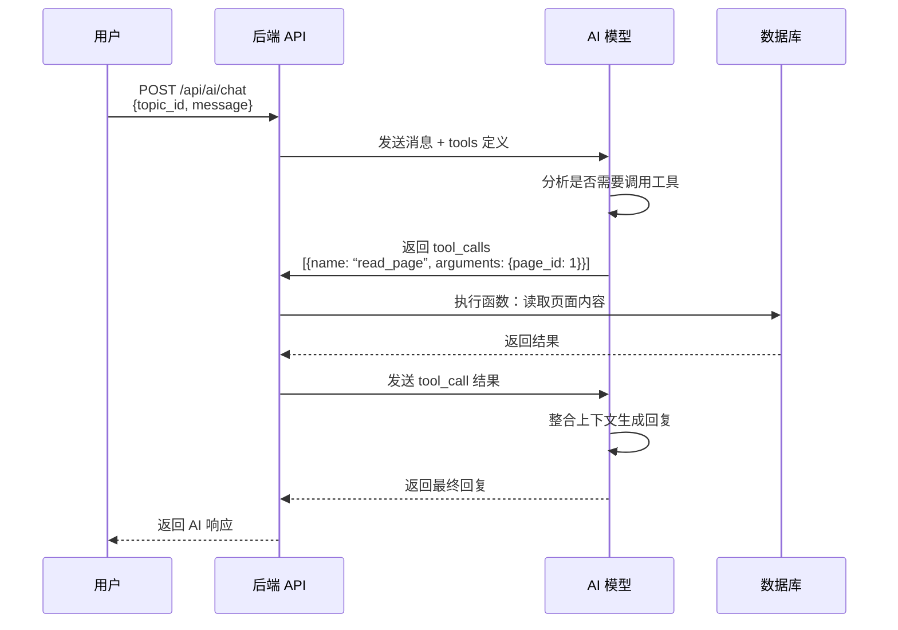

# AI Agent 系统

> 最后更新：2026-04-03（修订版）

## 概述

- 学习助手 Agent：服务学生与教师，聚焦学习问答与进度解释
- 专题搭建 Agent：服务教师，聚焦专题创建、内容组织和发布前检查

**实现方式：** 采用 OpenAI API 兼容的 function calling 格式，不自定义格式。

---

## 1. 学习助手 Agent

### 定位与目标

目标用户：学生、教师（需登录）

核心功能：围绕当前专题回答问题，解释专题内容，辅助学习理解。

设计原则：

- 上下文感知：问题必须绑定 `topic_id`，回答带专题上下文。
- 有据可查：回答引用页面内容来源，避免”无依据建议”。
- 只读优先：学习助手不修改业务数据。

### Agent 工具定义（OpenAI Function Calling 格式）

```json
{
  “tools”: [
    {
      “type”: “function”,
      “function”: {
        “name”: “get_topic_info”,
        “description”: “获取专题基础信息与状态”,
        “parameters”: {
          “type”: “object”,
          “properties”: {
            “topic_id”: {
              “type”: “integer”,
              “description”: “专题ID”
            }
          },
          “required”: [“topic_id”]
        }
      }
    },
    {
      “type”: “function”,
      “function”: {
        “name”: “list_pages”,
        “description”: “列出专题所有页面（仅知识库型）”,
        “parameters”: {
          “type”: “object”,
          “properties”: {
            “topic_id”: {
              “type”: “integer”,
              “description”: “专题ID”
            }
          },
          “required”: [“topic_id”]
        }
      }
    },
    {
      “type”: “function”,
      “function”: {
        “name”: “read_page”,
        “description”: “读取页面内容”,
        “parameters”: {
          “type”: “object”,
          “properties”: {
            “page_id”: {
              “type”: “integer”,
              “description”: “页面ID”
            }
          },
          “required”: [“page_id”]
        }
      }
    },
    {
      “type”: “function”,
      “function”: {
        “name”: “grep”,
        “description”: “在专题内容中搜索关键词”,
        “parameters”: {
          “type”: “object”,
          “properties”: {
            “topic_id”: {
              “type”: “integer”,
              “description”: “专题ID”
            },
            “keyword”: {
              “type”: “string”,
              “description”: “搜索关键词”
            }
          },
          “required”: [“topic_id”, “keyword”]
        }
      }
    }
  ]
}
```

### 适用场景

学生场景：

- 概念解释：例如”这门专题的核心学习重点是什么？”
- 内容定位：例如”和神经网络相关的页面有哪些？”
- 学习导航：例如”我应该从哪个页面开始学习？”

教师场景：

- 专题回顾：快速理解当前专题的内容结构和覆盖情况
- 内容检查：查看专题页面是否完整、是否有遗漏
- 课堂准备：让 Agent 给出”先讲什么、再练什么”的建议

### 权限控制

- 访客：不可使用学习助手（需登录）。

---

## 2. 专题搭建 Agent

### 定位与目标

入口展示在专题空间编辑页面上.

核心功能：帮助教师搭建专题空间，并将生成与编辑结果直接落库到业务表。

专题空间分为:

- 知识库型: 后台用数据表管理,前台渲染 Markdown
- 网站型: 后台是一个代码库,前台直接展示

根据空间不同,展示给agent的工具也不同.

当前网站模式仅支持网站 ZIP 包上传、删除、预览，不包含 webcontainer/bash 工具链。

设计原则：

- 落库优先：搭建 Agent 的核心输出是可追溯的数据库写入结果。
- 结构化建议：围绕 Topic/TopicPage 现有模型给建议。
- 发布前检查：给出缺口清单和可执行改进项。
- 操作留痕：所有自动写入操作保留审计记录。

### Agent 工具定义（OpenAI Function Calling 格式）

**知识库型工具集：**

```json
{
  “tools”: [
    {
      “type”: “function”,
      “function”: {
        “name”: “get_topic_info”,
        “description”: “获取专题基础信息与状态”,
        “parameters”: {
          “type”: “object”,
          “properties”: {
            “topic_id”: {
              “type”: “integer”,
              “description”: “专题ID”
            }
          },
          “required”: [“topic_id”]
        }
      }
    },
    {
      “type”: “function”,
      “function”: {
        “name”: “list_pages”,
        “description”: “列出专题所有页面”,
        “parameters”: {
          “type”: “object”,
          “properties”: {
            “topic_id”: {
              “type”: “integer”,
              “description”: “专题ID”
            }
          },
          “required”: [“topic_id”]
        }
      }
    },
    {
      “type”: “function”,
      “function”: {
        “name”: “read_page”,
        “description”: “读取页面 Markdown 内容”,
        “parameters”: {
          “type”: “object”,
          “properties”: {
            “page_id”: {
              “type”: “integer”,
              “description”: “页面ID”
            }
          },
          “required”: [“page_id”]
        }
      }
    },
    {
      “type”: “function”,
      “function”: {
        “name”: “write_file”,
        “description”: “写入页面 Markdown 内容（直接落库）”,
        “parameters”: {
          “type”: “object”,
          “properties”: {
            “page_id”: {
              “type”: “integer”,
              “description”: “页面ID”
            },
            “content”: {
              “type”: “string”,
              “description”: “Markdown 内容”
            }
          },
          “required”: [“page_id”, “content”]
        }
      }
    },
    {
      “type”: “function”,
      “function”: {
        “name”: “new_file”,
        “description”: “创建新页面（直接落库）”,
        “parameters”: {
          “type”: “object”,
          “properties”: {
            “topic_id”: {
              “type”: “integer”,
              “description”: “专题ID”
            },
            “title”: {
              “type”: “string”,
              “description”: “页面标题”
            },
            “parent_page_id”: {
              “type”: “integer”,
              “description”: “父页面ID（可选，用于嵌套）”
            }
          },
          “required”: [“topic_id”, “title”]
        }
      }
    }
  ]
}
```

**网站型专题说明：**

- 当前不提供额外的 agent 工具（无 bash/webcontainer）。
- 网站型专题由教师上传 ZIP 包并在前端 iframe 预览。

### 适用场景

- 新建专题时：生成专题描述并直接创建或更新专题空间内容。
- 编辑专题时：改写专题说明、补充页面内容并落库。
- 发布前：检查是否缺少关键页面、内容是否完整、结构是否合理等。

---

## 3. Function Calling 流程（OpenAI API 标准）

### 标准 OpenAI API 流程



### OpenAI API 格式示例

**第一步：用户发送消息**

```json
{
  “model”: “gpt-5.4”,
  “messages”: [
    {
      “role”: “user”,
      “content”: “这个专题的核心内容是什么？”
    }
  ],
  “tools”: [
    {
      “type”: “function”,
      “function”: {
        “name”: “get_topic_info”,
        “description”: “获取专题基础信息”,
        “parameters”: {...}
      }
    }
  ]
}
```

**第二步：AI 返回 tool_calls**

```json
{
  “id”: “chatcmpl-123”,
  “choices”: [
    {
      “message”: {
        “role”: “assistant”,
        “content”: null,
        “tool_calls”: [
          {
            “id”: “call_abc123”,
            “type”: “function”,
            “function”: {
              “name”: “get_topic_info”,
              “arguments”: “{\”topic_id\”: 1}”
            }
          }
        ]
      }
    }
  ]
}
```

**第三步：后端执行函数，返回结果**

```json
{
  “model”: “gpt-5.4”,
  “messages”: [
    {
      “role”: “user”,
      “content”: “这个专题的核心内容是什么？”
    },
    {
      “role”: “assistant”,
      “content”: null,
      “tool_calls”: [
        {
          “id”: “call_abc123”,
          “type”: “function”,
          “function”: {
            “name”: “get_topic_info”,
            “arguments”: “{\”topic_id\”: 1}”
          }
        }
      ]
    },
    {
      “role”: “tool”,
      “tool_call_id”: “call_abc123”,
      “content”: “{\”title\”: \”神经网络基础\”, \”description\”: \”深度学习入门课程\”, \”status\”: \”published\”}”
    }
  ]
}
```

**第四步：AI 返回最终回复**

```json
{
  “id”: “chatcmpl-456”,
  “choices”: [
    {
      “message”: {
        “role”: “assistant”,
        “content”: “根据专题信息，这个专题的核心内容是深度学习入门课程，主要讲解神经网络的基础知识...”
      }
    }
  ]
}
```

---

## 4. 上下文管理

- 上下文主键为 `agentType + topic_id + user_id`。
- 用户在哪个专题空间打开 Agent，就只加载该 `topic_id` 的上下文。
- 切换到新专题时，必须切换上下文命名空间，禁止复用上一专题的上下文。
- 会话历史可按上述主键落库，避免跨专题串话。

---

## 相关文档

- [产品概述](./overview.md)
- [功能清单](./features.md)
- [API 设计](./api-design.md)
- [数据模型](./data-models.md)
