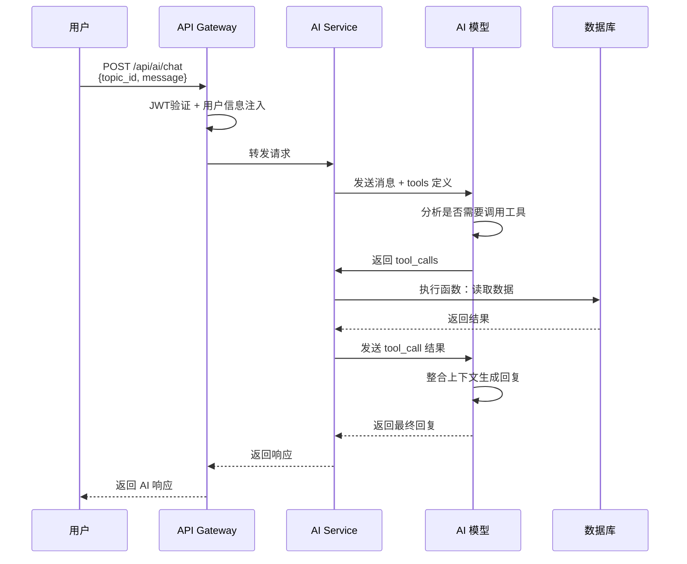
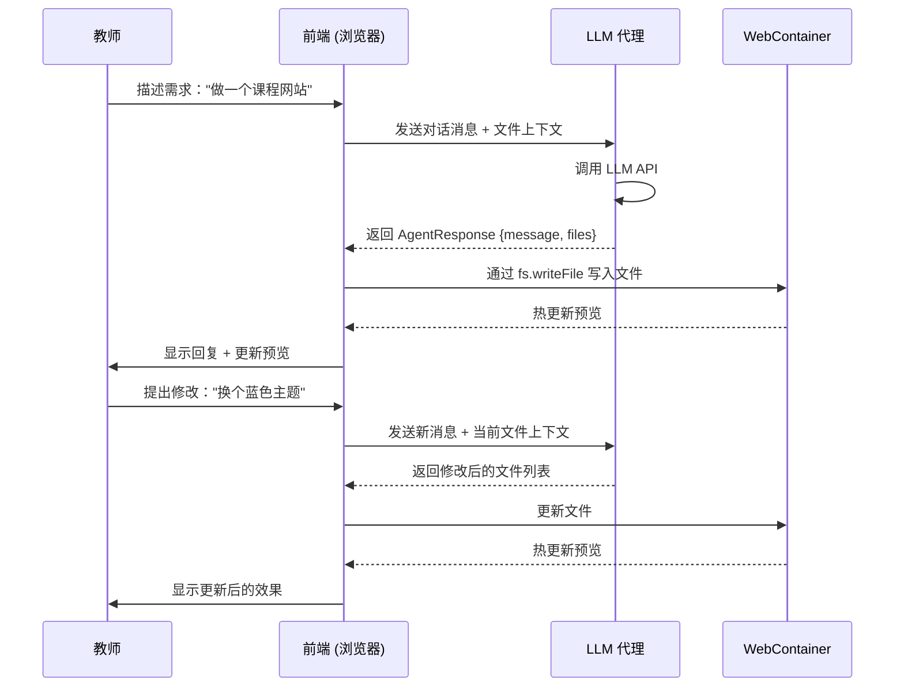

# AI Service

> 最后更新：2026-04-17

## 概述

AI Service 负责 AI 对话和 Agent 编排，提供学习助手和专题搭建两种 Agent。

**端口：** 3003
**代码路径：** `services/ai`
**API 端点：** `POST /api/ai/chat/completions` + 会话持久化端点
**数据库访问：** 只读访问 `auth_users`、`topic_topics` 表

## AI 对话端点

```
POST   /api/ai/chat/completions                 - AI 对话（需认证）
GET    /api/ai/conversations/:topicId/:agentType - 读取会话状态（需认证）
PUT    /api/ai/conversations/:topicId/:agentType - 替换会话状态（需认证）
```

## Agent 会话持久化

- 会话主键：`topicId + userId + agentType`
- `GET` 返回 `selectedSkills + compressedContext + messages`
- `PUT` 采用整段替换写入，消息只保留可见 `user/assistant`
- learning agent 与 building agent 共用该持久化接口，仅 `agentType` 不同
- skill 为声明式 prompt/profile 配置，不执行远程插件代码

**权限：**
- 访客：不可使用
- 用户（非editor）：可使用学习助手（所有已发布专题）
- 用户（editor）：可使用学习助手和搭建助手（有编辑权限的专题）

## 1. 学习助手 Agent

### 定位

服务用户（原学生与教师），聚焦学习问答与专题内容解释。

**设计原则：**
- 上下文感知：问题必须绑定 `topic_id`，回答带专题上下文
- 有据可查：回答引用网站页面内容来源
- 只读优先：不修改业务数据

### 工具定义（OpenAI Function Calling）

```json
{
  "tools": [
    {
      "type": "function",
      "function": {
        "name": "get_topic_info",
        "description": "获取专题基础信息与状态",
        "parameters": {
          "type": "object",
          "properties": {
            "topic_id": { "type": "integer", "description": "专题ID" }
          },
          "required": ["topic_id"]
        }
      }
    },
    {
      "type": "function",
      "function": {
        "name": "get_topic_files",
        "description": "获取专题的网站文件列表",
        "parameters": {
          "type": "object",
          "properties": {
            "topic_id": { "type": "integer", "description": "专题ID" }
          },
          "required": ["topic_id"]
        }
      }
    },
    {
      "type": "function",
      "function": {
        "name": "read_file",
        "description": "读取指定文件的内容",
        "parameters": {
          "type": "object",
          "properties": {
            "topic_id": { "type": "integer", "description": "专题ID" },
            "file_path": { "type": "string", "description": "文件路径" }
          },
          "required": ["topic_id", "file_path"]
        }
      }
    },
    {
      "type": "function",
      "function": {
        "name": "grep",
        "description": "在专题内容中搜索关键词",
        "parameters": {
          "type": "object",
          "properties": {
            "topic_id": { "type": "integer", "description": "专题ID" },
            "keyword": { "type": "string", "description": "搜索关键词" },
            "limit": { "type": "integer", "description": "返回最大条数（默认50，最大200）" },
            "offset": { "type": "integer", "description": "跳过条数（默认0）" }
          },
          "required": ["topic_id", "keyword"]
        }
      }
    }
  ]
}
```

**安全特性：**
- LIKE 查询特殊字符（`%`, `_`, `\`）自动转义
- grep 工具强制 limit/offset

### 适用场景

- **概念解释：** "这个专题的核心学习重点是什么？"
- **内容定位：** "和神经网络相关的页面有哪些？"
- **学习导航：** "我应该从哪个部分开始学习？"
- **专题回顾：** 快速理解当前专题的内容结构
- **内容检查：** 查看专题内容是否完整

## 2. 专题搭建 Agent

### 定位

入口在网站编辑器的中间对话面板，通过主动协作模式帮助教师将想法转化为网站代码。

**设计原则：**
- **主动协作：** Agent 先询问偏好（风格、布局、颜色等），再生成代码
- **即时预览：** 代码通过 WebContainer FS API 写入，实时预览验证
- **多轮对话：** 支持连续迭代修改
- **文件上下文：** 对话时自动带上当前打开文件的代码

### Agent Prompt 结构

```
你是一名专业的前端开发者，负责帮助用户将他们的想法转化为网站。

当前上下文：
- 专题标题：{topic_title}
- 已存在的文件：{file_list}
- 当前打开的文件：{current_file}（如有）

你的职责：
1. 理解用户的需求，如果需求不够具体，先询问用户的偏好
2. 根据用户的偏好生成完整的网站代码
3. 使用标准的前端技术栈（HTML/CSS/JS、React、Vue等）
4. 每次只返回需要创建/修改的文件列表，让前端执行文件操作

返回格式（JSON）：
{
  "message": "给用户的自然语言回复",
  "files": [
    {
      "path": "src/index.html",
      "action": "create",
      "content": "<!DOCTYPE html>..."
    }
  ]
}

可用操作：create（新建）、update（修改）、delete（删除）
```

### LLM API 接口

遵循 OpenAI Chat Completions API 标准格式：

```
POST /api/llm/chat/completions
Request:
{
  "model": "gpt-4o",
  "messages": [
    { "role": "system", "content": "你是一名专业的前端开发者..." },
    { "role": "user", "content": "帮我做一个课程网站，风格简约" }
  ],
  "response_format": { "type": "json_object" },
  "stream": true
}
```

前端使用 OpenAI SDK (`openai` npm包) 直接调用，后端代理转发到实际的 LLM 提供商（OpenAI/Claude等）。

> 注：LLM 代理端点实际由 Topic Space Service 提供，AI Service 作为代理转发。

## 3. Function Calling 流程



## 4. 专题搭建 Agent 流程（前端主导）



## 5. 上下文管理

- 上下文主键为 `agentType + topic_id + user_id`
- 用户在哪个专题空间打开 Agent，就只加载该 `topic_id` 的上下文
- 切换到新专题时必须切换上下文命名空间，禁止复用上一专题的上下文
- 会话历史可按上述主键落库，避免跨专题串话

## 6. 权限矩阵

| Agent 类型 | 访客 | 用户（非editor） | 用户（editor） |
|------|:----:|:----------------:|:--------------:|
| 学习助手（learning） | ✗ | ✓ 所有已发布的 | ✓ |
| 专题搭建（building） | ✗ | ✗ | ✓ 有编辑权限的专题 |

## 相关文档

- [Gateway Service](./gateway-service.md)
- [数据模型](./data-models.md)
- [功能清单](./features.md)
