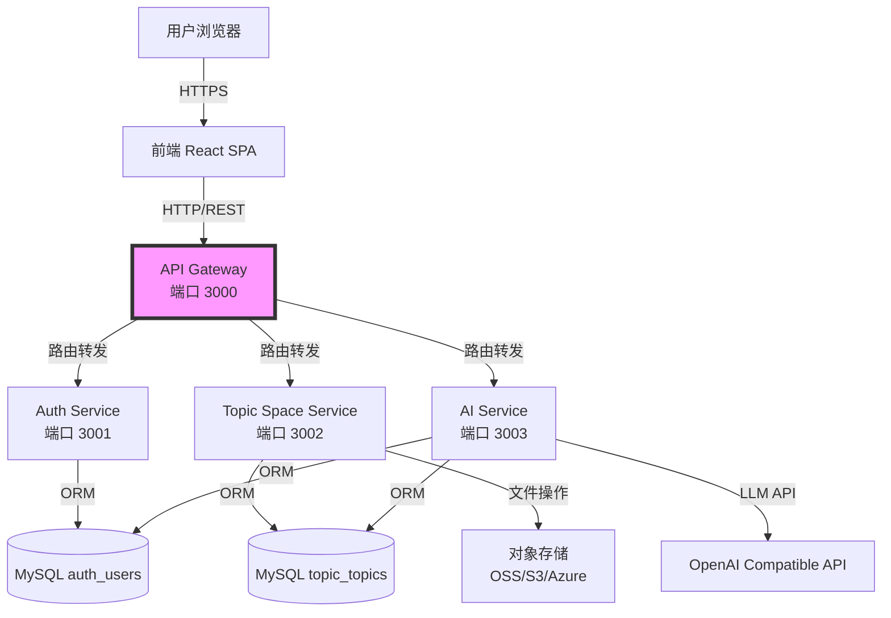
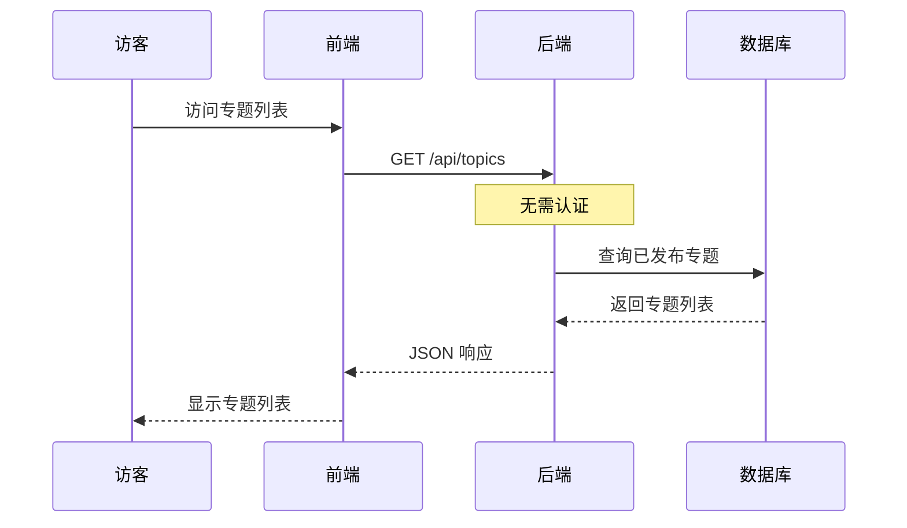
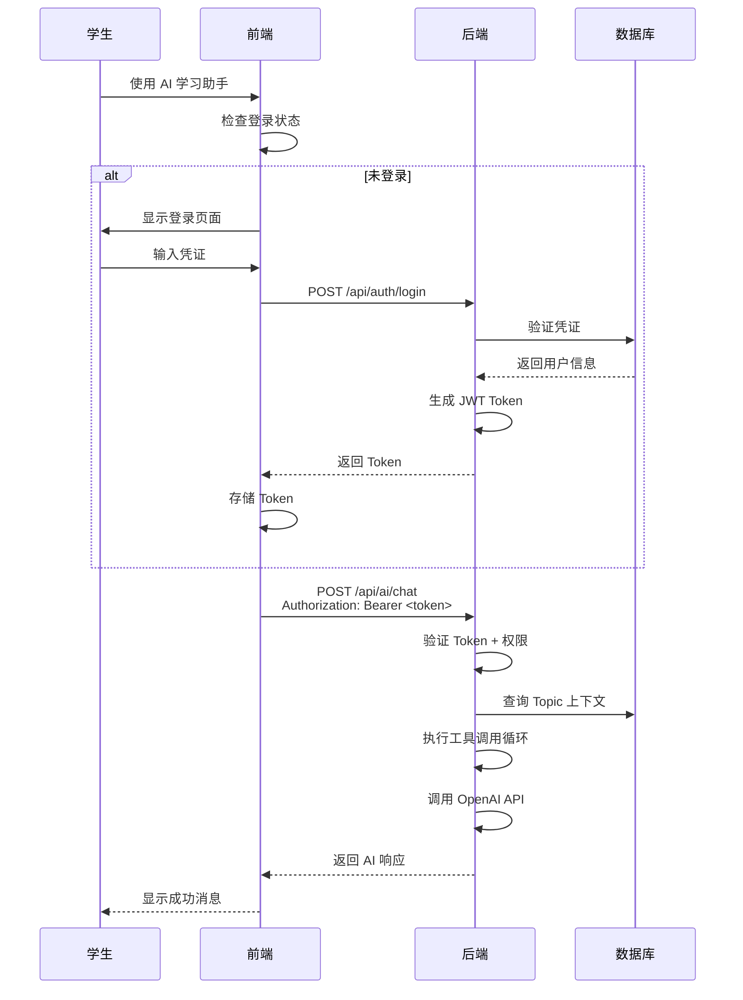

# 技术架构

> 最后更新：2026-04-12

## 系统架构

采用**前后端分离的微服务架构**，通过 API Gateway 统一入口，服务独立部署和扩缩容。



## 技术栈

### 前端

- **React 18** - UI 框架
- **TypeScript** - 类型安全
- **Vite** - 构建工具
- **TailwindCSS** - 样式框架
- **Axios** - HTTP 客户端
- **Zustand** - 状态管理

### 后端

- **Node.js 20** - 运行时
- **Express 4** - Web 框架
- **TypeScript** - 类型安全
- **Sequelize 6** - ORM
- **JWT (HS256)** - 身份认证
- **bcrypt** - 密码加密
- **OpenAI SDK** - AI 对话与 Function Calling
- **express-rate-limit** - 请求限流
- **http-proxy-middleware** - Gateway 路由转发

### 数据库

- **MySQL 8.0** - 关系型数据库

### 开发工具

- **pnpm workspace** - Monorepo 管理
- **Docker Compose** - 本地开发环境，生产部署
- **Jest** - 测试框架

## 微服务概览

| 服务 | 端口 | 职责 | 详情 |
|------|------|------|------|
| Gateway | 3000 | 路由转发、JWT 验证、限流 | [Gateway Service](./gateway-service.md) |
| Auth | 3001 | 用户注册/登录/JWT | [Auth Service](./auth-service.md) |
| Topic Space | 3002 | 专题 CRUD、Git 预签名 | [Topic Space Service](./topic-space-service.md) |
| AI | 3003 | AI 对话、Agent 编排 | [AI Service](./ai-service.md) |

**共享包：**
- **packages/utils** — 共享工具（config、database、logger）
- **shared** — 共享类型和认证中间件

## 部署架构

### Docker Compose 配置

```yaml
services:
  mysql:8.0                # 数据库（固定版本）
  auth                     # Auth Service
  topic-space              # Topic Space Service
  ai                       # AI Service
  gateway                  # API Gateway（唯一入口）
```

**特性：**
- 所有服务配置 `NODE_ENV=production`
- 健康检查通过 `/health` 端点实现
- Gateway 等待下游服务健康后才启动

### 开发环境

```
前端：http://localhost:5173
Gateway：http://localhost:3000
Auth Service：http://localhost:3001（内部）
Topic Space Service：http://localhost:3002（内部）
AI Service：http://localhost:3003（内部）
数据库：Docker MySQL 容器（端口 3306）
```

## 目录结构

```
web-learn/
├── frontend/               # React 前端应用
│   ├── src/
│   │   ├── components/    # UI 组件
│   │   ├── pages/         # 页面组件
│   │   ├── services/      # API 调用
│   │   ├── stores/        # 状态管理
│   │   ├── agent/         # Agent 运行时
│   │   ├── hooks/         # 自定义 Hooks
│   │   └── utils/         # 工具函数
│   └── package.json
│
├── services/               # 微服务
│   ├── gateway/           # API Gateway
│   ├── auth/              # Auth Service
│   ├── topic-space/       # Topic Space Service
│   └── ai/                # AI Service
│
├── packages/               # 旧共享包
│   └── utils/
├── shared/                 # 共享类型和认证中间件
├── docs/                   # 文档
│   ├── spec/              # 产品规格
│   ├── superpowers/       # 设计和实施计划
│   └── archive/           # 已完成项目归档
├── docker-compose.yml
├── package.json
└── pnpm-workspace.yaml
```

## 核心流程

### 公开访问流程



### 认证流程



## 相关文档

- [产品概述](./overview.md)
- [数据模型](./data-models.md)
- [Gateway Service](./gateway-service.md)
- [Auth Service](./auth-service.md)
- [Topic Space Service](./topic-space-service.md)
- [AI Service](./ai-service.md)
