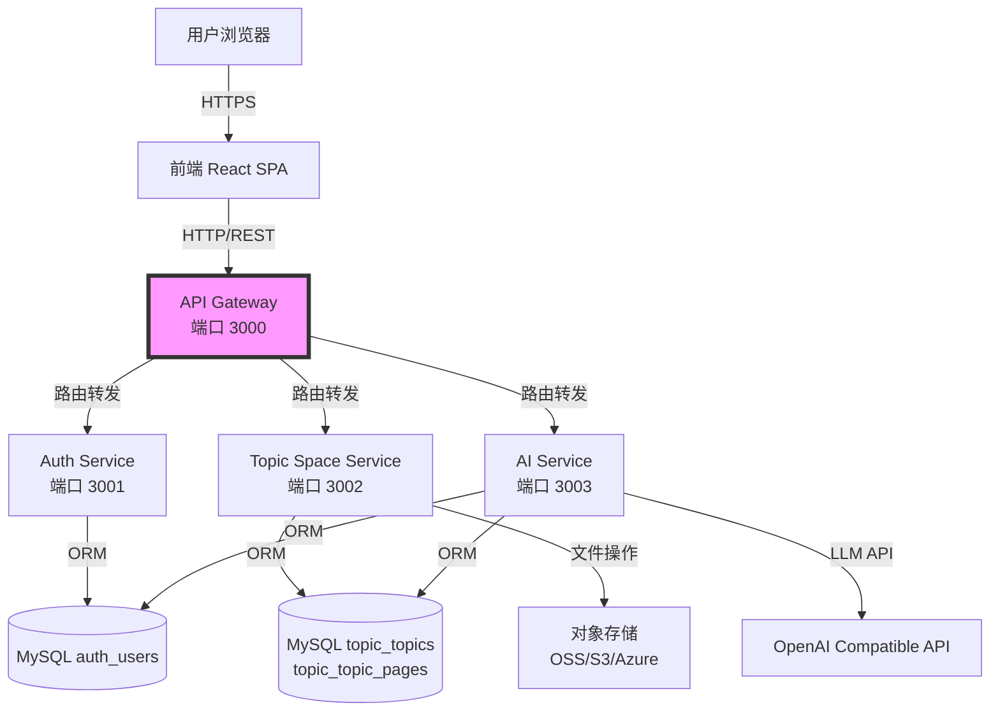
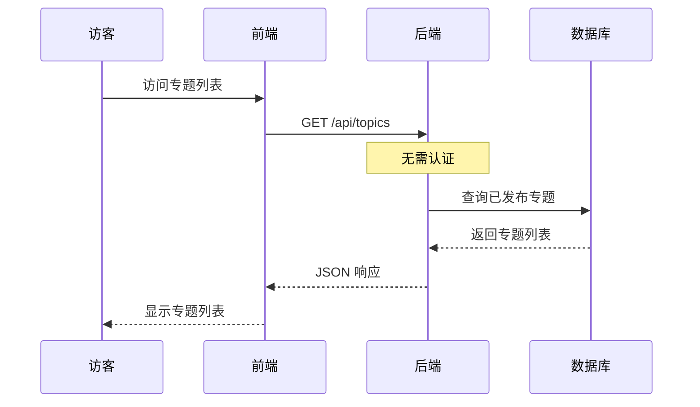
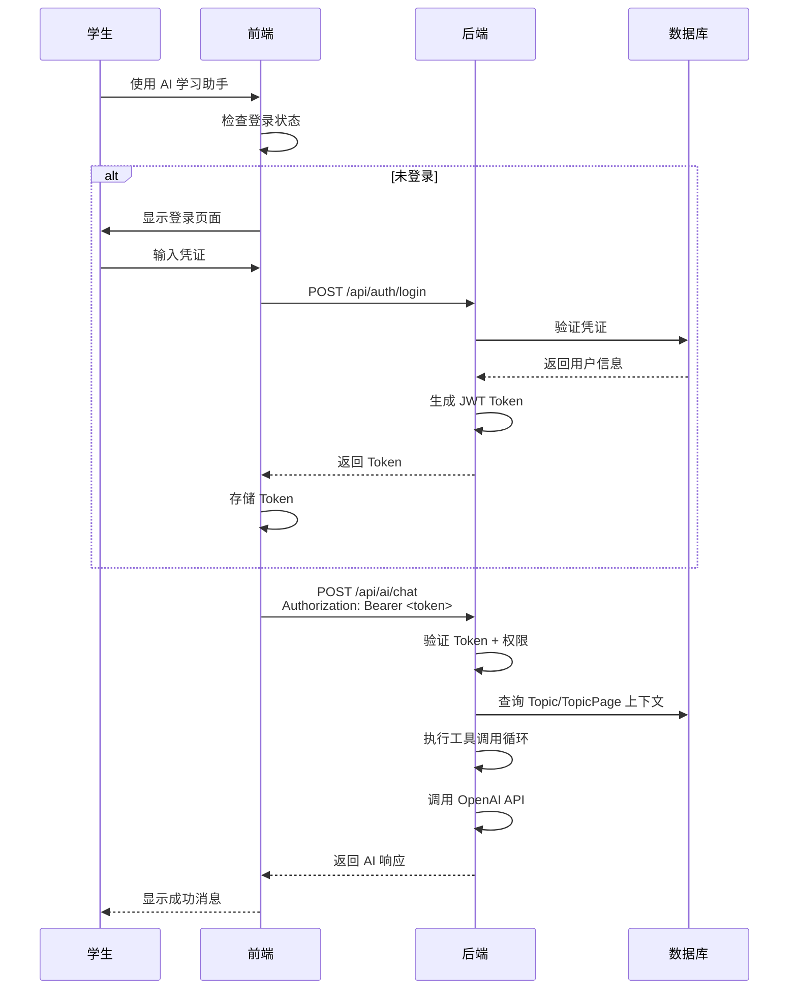

# 技术架构

> 最后更新：2026-04-06

## 系统架构

采用**前后端分离的微服务架构**，通过 API Gateway 统一入口，服务独立部署和扩缩容。



## 技术栈

### 前端

- **React 18** - UI 框架
- **TypeScript** - 类型安全
- **Vite** - 构建工具
- **TailwindCSS** - 样式框架
- **Axios** - HTTP 客户端
- **Zustand** - 状态管理

### 后端

- **Node.js 20** - 运行时
- **Express 4** - Web 框架
- **TypeScript** - 类型安全
- **Sequelize 6** - ORM
- **JWT (HS256)** - 身份认证，强制算法
- **bcrypt** - 密码加密
- **OpenAI SDK** - AI 对话与 Function Calling
- **express-rate-limit** - 请求限流
- **http-proxy-middleware** - Gateway 路由转发

### 数据库

- **MySQL 8.0** - 关系型数据库

### 开发工具

- **pnpm workspace** - Monorepo 管理（services/ + packages/）
- **Docker Compose** - 本地开发环境，生产部署
- **Jest** - 测试框架

### 微服务架构

采用 pnpm workspace monorepo 结构，每个服务独立 package：

- **Gateway** (`services/gateway`) - 路由转发、限流、CORS
- **Auth** (`services/auth`) - 用户注册/登录/JWT 颁发、认证中间件
- **Topic Space** (`services/topic-space`) - 专题 + 页面 CRUD + 网站上传
- **AI** (`services/ai`) - AI 对话 + 工具执行

共享包：

- **packages/utils** - 共享工具（config、database、logger）
- **packages/shared** - 共享类型定义（预留）

## 部署架构

### Docker Compose 配置

```yaml
services:
  mysql:8.0                # 数据库（固定版本）
  auth                     # Auth Service
  topic-space              # Topic Space Service
  ai                       # AI Service
  gateway                  # API Gateway（唯一入口）
```

**特性：**
- 所有服务配置 `NODE_ENV=production`
- 健康检查通过 `/health` 端点实现
- Gateway 等待下游服务健康后才启动
- `.dockerignore` 排除敏感文件和构建产物
- 数据库通过表前缀实现服务间数据隔离

### 开发环境

```
前端：http://localhost:5173
Gateway：http://localhost:3000
Auth Service：http://localhost:3001（内部）
Topic Space Service：http://localhost:3002（内部）
AI Service：http://localhost:3003（内部）
数据库：Docker MySQL 容器（端口 3306）
```

**本地开发：**
- 可单独启动服务：`pnpm --filter @web-learn/<service> dev`
- Docker Compose 全流程测试：`docker-compose up`

### 生产环境建议

**前端：**
- 静态文件托管（Nginx/CDN）
- HTTPS SSL 证书

**后端（微服务）：**
- 容器编排（Kubernetes / Docker Swarm）
- 服务发现和负载均衡
- 环境变量配置（JWT_SECRET、DB_*、OPENAI_API_KEY）

**数据库：**
- 云数据库（如阿里云 RDS）
- 自动备份
- 生产环境使用 sequelize-cli/umzug 迁移工具

**文件存储：**
- 对象存储（OSS/S3/Azure Blob）
- CDN 加速

**安全加固：**
- HTTPS 加密传输
- JWT 强制 HS256 算法
- 认证端点 rate limiting
- 防火墙规则
- 定期安全审计

## 目录结构

```
web-learn/
├── frontend/               # React 前端应用
│   ├── src/
│   │   ├── components/    # UI 组件
│   │   ├── pages/         # 页面组件
│   │   ├── services/      # API 调用
│   │   ├── stores/        # 状态管理
│   │   └── types/         # TypeScript 类型
│   └── package.json
│
├── services/               # 微服务（pnpm workspace packages）
│   ├── gateway/           # API Gateway
│   │   ├── src/
│   │   │   ├── index.ts          # 启动入口
│   │   │   ├── app.ts            # Express app + /health
│   │   │   ├── proxy.ts          # 路由转发配置
│   │   │   └── proxyMiddleware.ts # JWT验证 + 转发
│   │   └── package.json
│   │
│   ├── auth/              # Auth Service（用户注册/登录/JWT）
│   │   ├── src/
│   │   │   ├── index.ts
│   │   │   ├── app.ts            # Express app + /health
│   │   │   ├── routes/
│   │   │   │   ├── auth.ts       # 注册/登录（带rate limit）
│   │   │   │   └── users.ts      # 用户信息
│   │   │   ├── controllers/
│   │   │   ├── middlewares/
│   │   │   │   └── authMiddleware.ts # JWT验证（HS256强制）
│   │   │   ├── models/
│   │   │   │   └── User.ts       # auth_users表
│   │   │   └── utils/
│   │   │       ├── config.ts     # DOTENV_CONFIG_PATH支持
│   │   │       └── database.ts   # Sequelize连接
│   │   └── package.json
│   │
│   ├── topic-space/       # Topic + Page Service
│   │   ├── src/
│   │   │   ├── index.ts
│   │   │   ├── app.ts            # Express app + /health
│   │   │   ├── routes/
│   │   │   │   ├── topicRoutes.ts # 专题管理
│   │   │   │   └── pageRoutes.ts  # 页面管理
│   │   │   ├── models/
│   │   │   │   ├── User.ts       # topic_users表（共享auth_users）
│   │   │   │   ├── Topic.ts      # topic_topics表
│   │   │   │   └── TopicPage.ts  # topic_topic_pages表
│   │   │   ├── services/
│   │   │   │   ├── storageService.ts      # OSS/S3接口
│   │   │   │   └── nullStorageService.ts  # Null Object模式
│   │   │   └── utils/
│   │   └── package.json
│   │
│   └── ai/                # AI Service
│       ├── src/
│       │   ├── index.ts
│       │   ├── app.ts            # Express app + /health
│       │   ├── routes/
│       │   │   └── aiRoutes.ts   # AI对话端点
│       │   ├── services/
│       │   │   ├── agentService.ts     # Agent编排
│       │   │   └── agentTools.ts       # 工具定义（带limit/offset）
│       │   ├── models/
│       │   │   ├── User.ts       # auth_users表
│       │   │   ├── Topic.ts      # topic_topics表
│       │   │   └── TopicPage.ts  # topic_topic_pages表
│       │   └── utils/
│       └── package.json
│
├── packages/               # 共享包
│   ├── utils/             # 共享工具
│   │   ├── src/
│   │   │   ├── config.ts         # DOTENV_CONFIG_PATH支持
│   │   │   └── ...
│   │   └── package.json
│   └── shared/            # 共享类型（预留）
│       └── package.json
│
├── backend/                # 原单体应用（保留用于本地开发）
│   └── ...
│
├── docs/                   # 文档
│   ├── spec/              # 产品规格文档
│   ├── microservices-architecture-design.md # 微服务架构设计
│   └── archive/           # 已完成项目归档
│       └── implementation-status-microservices-refactoring-2026-04-06.md
│
├── docker-compose.yml      # Docker编排配置
├── .dockerignore           # Docker构建排除文件
├── package.json           # Monorepo 根配置
└── pnpm-workspace.yaml    # pnpm workspace 配置
```

## 核心流程

### 公开访问流程



### 认证流程



## 相关文档

- [产品概述](./overview.md)
- [API 设计](./api-design.md)
- [数据模型](./data-models.md)
