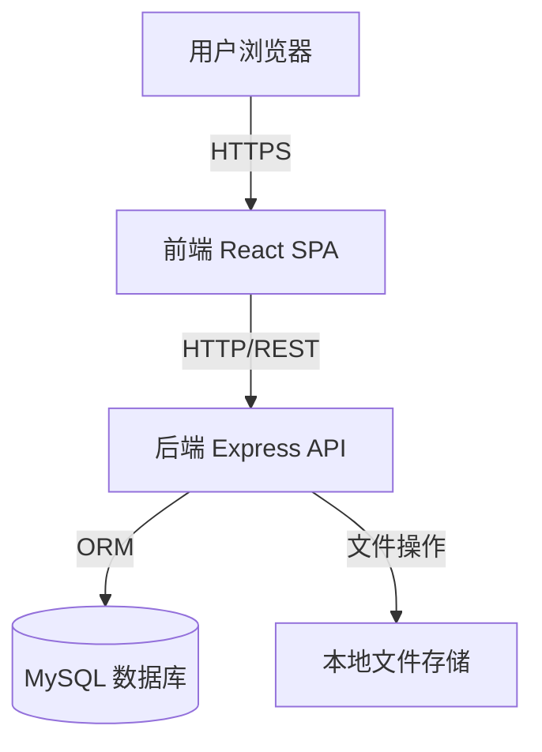
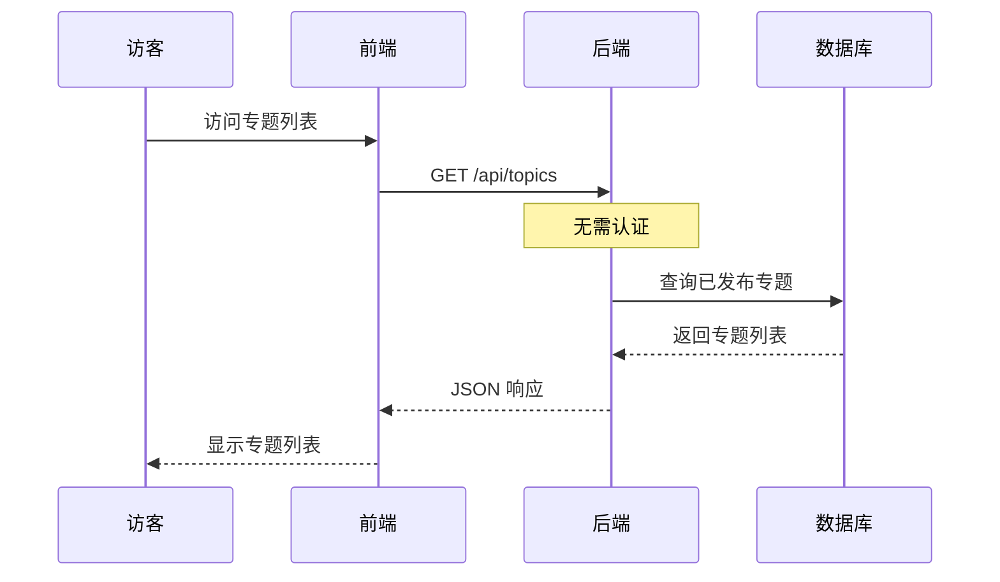
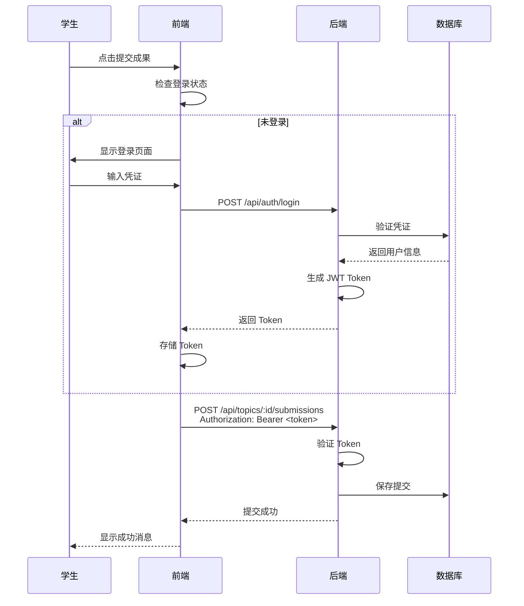

# 技术架构

> 最后更新：2026-04-03

## 系统架构

采用**前后端分离的单体应用架构**，适合中小规模教育场景。



## 技术栈

### 前端

- **React 18** - UI 框架
- **TypeScript** - 类型安全
- **Vite** - 构建工具
- **TailwindCSS** - 样式框架
- **Axios** - HTTP 客户端
- **Zustand** - 状态管理

### 后端

- **Node.js 20** - 运行时
- **Express 4** - Web 框架
- **TypeScript** - 类型安全
- **Sequelize 6** - ORM
- **JWT** - 身份认证
- **bcrypt** - 密码加密

### 数据库

- **MySQL 8.0** - 关系型数据库

### 开发工具

- **pnpm workspace** - Monorepo 管理
- **Docker Compose** - 本地开发环境
- **Jest** - 测试框架

## 部署架构

### 开发环境

```
前端：http://localhost:5173
后端：http://localhost:3001
数据库：Docker MySQL 容器
```

### 生产环境建议

**前端：**
- 静态文件托管（Nginx/CDN）
- HTTPS SSL 证书

**后端：**
- 云服务器或容器服务
- 环境变量配置

**数据库：**
- 云数据库（如阿里云 RDS）
- 自动备份

**文件存储：**
- 对象存储（如 OSS/S3）
- CDN 加速

**安全：**
- HTTPS 加密传输
- 防火墙规则
- 定期安全审计

## 目录结构

```
web-learn/
├── frontend/               # React 前端应用
│   ├── src/
│   │   ├── components/    # UI 组件
│   │   ├── pages/         # 页面组件
│   │   ├── services/      # API 调用
│   │   ├── stores/        # 状态管理
│   │   └── types/         # TypeScript 类型
│   └── package.json
│
├── backend/                # Express 后端 API
│   ├── src/
│   │   ├── controllers/   # 业务逻辑
│   │   ├── models/        # 数据模型
│   │   ├── routes/        # 路由定义
│   │   ├── middlewares/   # 中间件
│   │   └── utils/         # 工具函数
│   └── package.json
│
├── shared/                 # 前后端共享类型
│   └── src/types/
│
├── docs/                   # 文档
│   ├── spec/              # 产品规格文档
│   ├── data-models.md     # 数据模型文档
│   └── implementation-status.md
│
├── docker-compose.yml      # 开发环境配置
├── package.json           # Monorepo 根配置
└── pnpm-workspace.yaml    # pnpm workspace 配置
```

## 核心流程

### 公开访问流程



### 认证流程



## 相关文档

- [产品概述](./overview.md)
- [API 设计](./api-design.md)
- [数据模型](./data-models.md)